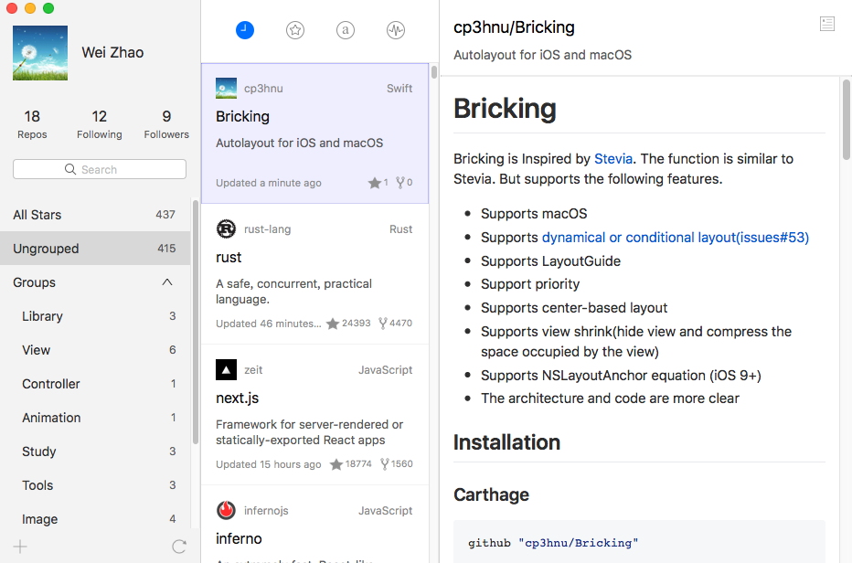
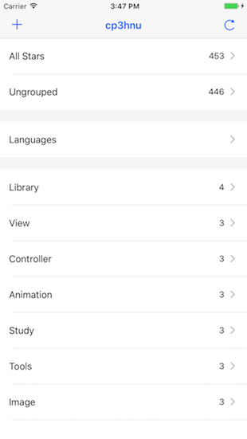
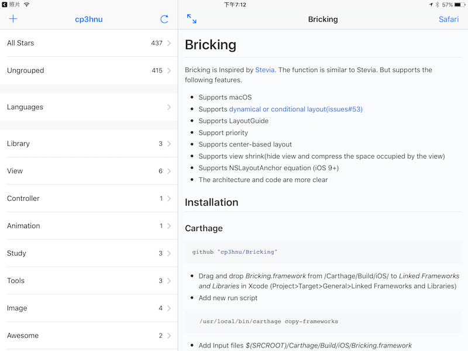

# Starry
Group, manage and read your starred repositories on GitHub. 

You might have a problem like that you want to find a repository from hundreds of your starred repositories on GitHub, and you forget the name, owner, and description of the repository. To find it, you need to traverse all of your starred repositories. This is very troublesome. 

But by grouping your starred repositories, you can easily find it . The more detailed the group is, the easier it is to find it. Also, if you have multiple devices(iPhone, iPad and Mac), you want to see these groups at the same time. This is the purpose of Starry. 

 Starry has the following features.

* Group you starred repositories on github

* Synchronize your groups to all of your iPhone, iPad and Mac

* Language groups based on the languages of repositories

* Caching documents and images of repositories

* Read repositories. You can adjust the font size of repository document in read mode

* Search starred repositories via the name, owner, and description of repository

* Sort starred repositories by the starred date, star count of repository, repository name and update date of repository

* Unstar repositories

  ​

## Screenshot

### Mac

### iPhone

### iPad

## Video

[Starry Video for Mac](video/Mac.mp4)

Video is too large, you need to download first.

## Starry Pro (Mac)

$2.99 for Starry Pro (unlimited groups, 5 groups for free)

**Declaration:** Just to pay for data synchronization server costs. Now the minimum configuration for the data synchronization server is $100/year. With the increase of users,  the server may need to upgrade. I used to consider using the professional or enterprise edition of Realm Platform, but it was too expensive to afford it.

**All revenue will be used for data synchronization server and software maintenance.**

## Download

[Starry for Mac](https://itunes.apple.com/us/app/starry/id1281893044)

[Starry for iPhone and iPad](https://itunes.apple.com/cn/app/starry-group-your-star/id1281874667?mt=8)

## Little known details

### Mac

* **Delete group:** cmd + delete
* **Rename group:** Select a group then click the left mouse button or click the return key
* **Copy repository to a group:** Hold down the option key and drag repository to a group
* **Reverse order:** Click the same button at the top of the middle column twice
* **Index starred repositories:** Click the third button at the top of the middle column, then click alphabet key 
* **Back or Forward in repository document page:** Click the right mouse button

### iPhone and iPad

* **Sort starred repositories:** In repository list page, pull down. Continue to pull down to change sort type or switch ascending or descending order
* **Back or Forward in repository document page:** Swipe from left edge to right or click the ← button to back to previous page.  Swipe from right edge to left to next page

## Third Party Libraries

[realm-cocoa](https://github.com/realm/realm-cocoa)

[Bricking](https://github.com/cp3hnu/Bricking)

[Alamofire](https://github.com/Alamofire/Alamofire)

[RxSwift](https://github.com/ReactiveX/RxSwift)

[ObjectMapper](https://github.com/Hearst-DD/ObjectMapper)

[MBProgressHUD](https://github.com/jdg/MBProgressHUD)

[Kingfisher](https://github.com/onevcat/Kingfisher)

[KeychainAccess](https://github.com/kishikawakatsumi/KeychainAccess)

[SwiftyStoreKit](https://github.com/bizz84/SwiftyStoreKit)

## Issues

If you have a question or a good suggestion, do not hesitate to post an [issue](https://github.com/cp3hnu/Starry/issues). I'll try my best to solve it.

